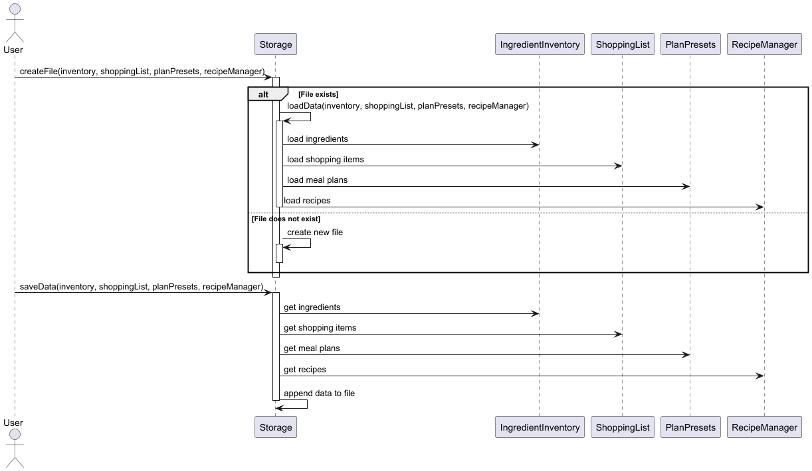

# Developer Guide

## Acknowledgements

{list here sources of all reused/adapted ideas, code, documentation, and third-party libraries -- include links to the original source as well}

## Design & implementation

{Describe the design and implementation of the product. Use UML diagrams and short code snippets where applicable.}

## Product scope
### Target user profile

{Describe the target user profile}

### Value proposition

{Describe the value proposition: what problem does it solve?}

## User Stories

|Version| As a ... | I want to ... | So that I can ...|
|--------|----------|---------------|------------------|
|v1.0|new user|see usage instructions|refer to them when I forget how to use the application|
|v2.0|user|find a to-do item by name|locate a to-do without having to go through the entire list|

## Non-Functional Requirements

{Give non-functional requirements}

## Glossary

* *glossary item* - Definition

## Instructions for manual testing

{Give instructions on how to do a manual product testing e.g., how to load sample data to be used for testing}

# Implementation of the Parser Feature

## Overview
The Parser feature is a crucial component of the application, responsible for interpreting and processing user input.
It serves as the bridge between the user interface and the underlying logic of the application, ensuring that commands are correctly understood and executed.

## Design and Implementation
The Parser feature is designed to be modular and extensible, allowing for easy addition of new commands and functionalities. The core components of the Parser feature include:
1. **Command Classes**: Each command is represented by a separate class, which encapsulates the logic and parameters associated with that command. This design allows for clear separation of concerns and makes it easy to add new commands in the future.

2. **Parser Class**: The `Parser` class is responsible for parsing the user input and instantiating the appropriate command class. It uses a series of `switch` statements to determine the type of command based on the input string.

3. **Command Execution**: Once the command is parsed and instantiated, it is executed by calling the `execute` method on the command object. This method contains the logic for performing the action associated with the command.

4. **Error Handling**: The Parser feature includes robust error handling to manage invalid input and provide feedback to the user. If the input cannot be parsed or if the command is not recognized, an appropriate error message is displayed.

# Sequence Diagram

The following sequence diagram illustrates the interaction between the user, the `Parser`, and the `Command` classes during the execution of a command:

### Why It Is Implemented This Way
The Parser feature is implemented this way to ensure a clear and maintainable structure. By using separate command classes, we can easily extend the functionality of the application without modifying the core parsing logic.
By encapsulating the command logic within individual classes, we adhere to the Single Responsibility Principle, making the codebase easier to understand and maintain.

# Implementation of the Storage Feature

## Overview

The Storage feature is responsible for managing the persistence of data when the application exits. It handles the reading
and writing of data to and from `data.txt`, ensuring that user data is saved and can be retrieved when the application is relaunched

## Design and Implementation

The Storage feature is designed to be modular and extensible, allowing for easy addition of new data types and functionalities. The core components of the Storage feature include:
1. **Storage Class**: The `Storage` class is responsible for managing the reading and writing of data to and from `data.txt`. It provides methods for loading data from the file and saving data back to the file.
2. **Data Classes**: The Storage feature interacts with various data classes, such as `IngredientInventory`, `ShoppingList`, `RecipeManager`, and `PlanPresets`. Each of these classes represents a specific type of data list and provides methods for manipulating that list.
3. **File Handling**: The Storage feature uses file handling techniques to read and write data to `data.txt`. It ensures that the data is formatted correctly and that any errors during file operations are handled gracefully.

# Sequence Diagram

The following sequence diagram illustrates the interaction between the `Storage` class and the other key lists in the application during the loading and saving of data:
The key lists include: `StockList`, `LowStockList`, `RecipeList`, `ShoppingList`

